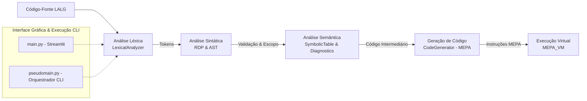

# Arquitetura e Funcionamento do Compilador LALG

Este documento apresenta uma explicação completa, detalhada e acessível sobre a estrutura interna e o funcionamento do **Compilador LALG** (Linguagem Algorítmica Simplificada baseada em Pascal).

Aqui você encontrará a explicação de **cada arquivo do projeto**, dividida entre o ponto de entrada da interface visual `main.py` e todos os módulos internos localizados na pasta `modules/`, além de uma visão panorâmica do pipeline de compilação.

---

## Visão Geral da Arquitetura

O compilador segue o pipeline clássico de compilação de linguagens de programação, dividido em 5 etapas principais:



### O Fluxo em 5 Etapas:
1. **Análise Léxica**: Transforma o código textual em uma sequência de unidades significativas chamadas **Tokens** (ignorando espaços e comentários).
2. **Análise Sintática**: Verifica se os tokens seguem as regras gramaticais da linguagem LALG através de um **Analisador Descendente Recursivo (RDP)** e constrói a **Árvore Sintática Abstrata (AST)**.
3. **Análise Semântica**: Valida regras de negócio da linguagem (declaração de variáveis, compatibilidade de tipos, escopos e verificação de variáveis não utilizadas) utilizando a **Tabela de Símbolos**.
4. **Geração de Código Intermediário**: Converte o código analisado em instruções assembly/bytecode para a **Máquina Virtual MEPA** (como `INPP`, `AMEM`, `CRVL`, `ARMZ`, `SOMA`, `PARA`).
5. **Interpretação e Execução**: A máquina virtual baseada em pilha (**MEPA_VM**) executa o bytecode gerado e produz os resultados de saída (prints ou entradas de dados).

---

## Arquivo Principal: `main.py`

O arquivo `main.py` é a **Interface Gráfica Web interativa** da aplicação, desenvolvida com o framework **Streamlit**. Ele funciona como um painel visual de inspeção para todas as fases do compilador.

### Principais Responsabilidades:
* **Entrada de Código**: Permite ao usuário digitar o código LALG diretamente ou carregar um arquivo `.txt`, além de fornecer códigos de exemplo pré-carregados (atribuição, expressões aritméticas, erros sintáticos e semânticos).
* **Integração das Fases**: Instancia e coordena o analisador léxico, o parser sintático, a tabela de símbolos e a execução semântica/MEPA.
* **Organização em Abas Visuais**:
  1. **Análise Léxica**: Mostra a tabela de tokens extraídos (lexema, tipo, linha e coluna) e erros léxicos encontrados.
  2. ** Árvore Sintática (AST)**: Renderiza a AST gerada com três modos de visualização:
     * *Gráfico Visual (Graphviz)*: Desenho de árvore colorido com distinção entre nós sintáticos (azul), tokens folha (verde) e erros (vermelho/amarelo).
     * *Árvore Interativa (Expansores)*: Nós expansíveis no Streamlit.
     * *Estrutura Textual (ASCII Tree)*: Visualização hierárquica em texto puro.
  3. **Semântica & Execução MEPA**: Apresenta os diagnósticos semânticos, a lista de instruções MEPA geradas linha a linha e o resultado da execução do programa na máquina virtual MEPA.
  4. **Tabela de Símbolos**: Exibe a tabela de símbolos em tempo real com detalhes sobre identificadores, categorias (`var`, `proc`, `tipo`, `const`), tipos, níveis de escopo e endereços de memória.

---

## Módulos Internos (`modules/`)

A pasta `modules/` contém toda a lógica do compilador, dividida em arquivos especializados:

---

### 1. `abstractions.py`

Contém as **estruturas de dados abstratas** essenciais que alimentam o compilador.

* **`Token`**: Classe que representa um token extraído do código-fonte. Armazena:
  * `name`: O tipo do token (ex: `identifier`, `integer`, `keyword`, `op_sum`).
  * `value`: O valor/lexema exato (ex: `x`, `42`, `if`, `+`).
  * `lin` e `col`: A posição do token no código para relatórios de erros precisos.
* **`AST_Node`**: Representa um nó da Árvore de Sintaxe Abstrata. Possui um nome, referência ao nó pai (`father`), lista de nós filhos (`children`) e um status (`valid`, `invalid`, `error`).
* **`AST`**: Classe gerenciadora da árvore sintática. Oferece métodos para criar a raiz (`create_root`), adicionar novos nós intermediários (`add_node`), anexar folhas de token (`add_leaf`) e navegar/validar a estrutura durante o parsing.

---

### 2. `formal_grammar.py`


Define a representação dos elementos da **Gramática Formal** e do **Alfabeto** da linguagem.

* **`Symbol`**: Representa um caractere ou símbolo individual do alfabeto, associando seu caractere ao seu tipo (`digit`, `character`, `separator`, `operator`).
* **`Alphabet`**: Funciona como o repositório central do alfabeto da linguagem. Permite checar rapidamente se um determinado caractere é válido na LALG e consultar sua categoria (se é dígito, letra, operador ou separador).
* **`NonTerminal`**: Classe base estrutural para representação dos símbolos não-terminais da gramática BNF da linguagem.

---

### 3. `registry.py`

Implementa a **Tabela de Símbolos** e a gestão de escopos.

* **`Element`**: Representa uma linha/entrada na tabela de símbolos. Armazena:
  * `identificador`: Nome da variável, constante ou procedimento (ex: `x`, `limite`).
  * `categoria`: Classificação do elemento (`var`, `proc`, `tipo`, `const`).
  * `tipo`: Tipo de dado associado (`integer`, `boolean`).
  * `nivel`: O nível de escopo em que foi declarado ($0$ para global, $1, 2...$ para blocos internos).
  * `end_relativo`: Endereço de memória relativa alocado na pilha MEPA.
  * `utilizada`: Flag booleana que indica se a variável foi lida ou atribuída (para avisar sobre variáveis mortas/não utilizadas).
  * `num_params` e `tipos_params`: Informações de suporte a procedimentos.
* **`SymbolicTable`**: Gerencia a coleção de elementos em uma lista. Oferece busca de trás para frente (priorizando o escopo mais interno/recente), verificação de re-declarações no mesmo escopo (`busca_nivel_atual`), remoção de escopos ao encerrar um bloco (`remover_nivel`) e marcação de uso de variáveis (`marcar_utilizada`).

---

### 4. `diagnostics.py`

Mecanismo central de **acumulação e reporte de diagnósticos (erros e avisos)**.

* **`Diagnostics`**: Armazena todas as inconsistências encontradas durante a compilação em uma lista de erros.
  * `add(fase, mensagem, linha, coluna)`: Adiciona uma nova ocorrência categorizada pela fase (`lexica`, `sintatica`, `semantica`, `execucao`).
  * `has_errors()`: Retorna se houve algum erro impeditivo.
  * `report()`: Imprime o relatório formatado de diagnósticos no console.

---

### 5. `codegen.py`

Módulo responsável pela **Geração de Código Intermediário MEPA**.

* **`INSTRUCOES_VALIDAS`**: Conjunto constante contendo todos os opcodes reconhecidos pela MEPA (`INPP`, `AMEM`, `DMEM`, `CRCT`, `CRVL`, `ARMZ`, `SOMA`, `SUBT`, `MULT`, `DIVI`, `DSVS`, `DSVF`, `LEIT`, `IMPR`, `PARA`, etc.).
* **`Instruction`**: Classe simples para representar uma instrução no formato `OPCODE ARG` (ex: `CRVL 0`).
* **`CodeGenerator`**:
  * Mantém o vetor de código `C` (lista de instruções).
  * `gerar(op, arg)`: Emite uma nova instrução e retorna seu índice no vetor.
  * `back_patch(pos, arg)`: Preenche/atualiza retroativamente o argumento de uma instrução (técnica essencial para resolver endereços de desvios condicionais e incondicionais como `DSVF` e `DSVS` antes de saber a linha de destino).
  * `novo_end_relativo()`: Incrementa e retorna o próximo endereço de memória disponível para variáveis.

---

### 6. `engine.py`

É o **motor principal do compilador** (o arquivo mais extenso), agrupando o Analisador Léxico e o Analisador Sintático/Semântico.

* **`RESERVED_WORDS`**: Conjunto de palavras reservadas da linguagem LALG (`program`, `procedure`, `begin`, `end`, `var`, `if`, `then`, `else`, `while`, `do`, `div`, `and`, `or`, `not`).
* **`LexicalAnalyzer`**:
  * Lê o código-fonte caractere a caractere utilizando ponteiros de posição, linha e coluna.
  * Descarta espaços em branco e comentários de bloco `{ ... }` ou de linha `/ ...`.
  * Reconhece identificadores, diferencia palavras reservadas, reconhece números inteiros e reais, e detecta operadores compostos (`:=`, `<=`, `>=`, `<>`).
  * Trata erros léxicos (ex: caracteres fora do alfabeto, comentários não fechados).
* **`RDP` (Recursive Descent Parser)**:
  * Implementa o **Parsing Descendente Recursivo** mapeando cada não-terminal da gramática LALG para um método privado (ex: `parse_program`, `__parse_block`, `__parse_var_dec`, `__parse_expr`, `__parse_command`).
  * Simultaneamente constrói a **AST** e invoca verificações semânticas (existência de variáveis, compatibilidade de tipos em expressões, controle de escopo).
  * Emite código MEPA através do `CodeGenerator` acoplado.
  * Utiliza a tabela de sincronização `LAST_SET` para recuperação graciosa de erros sintáticos (Modo Pânico / Sincronização).

---

### 7. `interpreter.py`

Implementa a **Máquina Virtual MEPA (`MEPA_VM`)**, responsável por executar o bytecode gerado.

* **`MEPA_VM`**:
  * Funciona como uma máquina orientada a pilha (*Stack Machine*).
  * Contém a pilha de dados `D`, o ponteiro de topo de pilha `s`, e o ponteiro de instrução `i`.
  * `executar(C, entrada)`: Percorre o vetor de instruções `C`, executando os métodos correspondentes a cada opcode através de um dicionário de dispatch (`_dispatch`).
  * **Opcode Handlers principais**:
    * *Gestão de Pilha/Memória*: `INPP` (inicia), `AMEM` (aloca memória), `DMEM` (desaloca memória), `PARA` (interrompe).
    * *Carga/Armazenamento*: `CRCT` (carrega constante), `CRVL` (carrega valor de variável na pilha), `ARMZ` (armazena topo da pilha na variável).
    * *Aritmética e Lógica*: `SOMA`, `SUBT`, `MULT`, `DIVI`, `MODI`, `INVR`, `CONJ` (AND), `DISJ` (OR), `NEGA` (NOT).
    * *Comparações*: `CMME` (<), `CMMA` (>), `CMIG` (=), `CMDG` (<>), `CMAG` (>=), `CMEG` (<=).
    * *Desvios*: `DSVS` (desvio incondicional), `DSVF` (desvio se falso).
    * *Entrada e Saída*: `LEIT` (lê inteiro) e `IMPR`/`IMPE` (imprime valores no buffer de saída).

---

### 8. `pseudomain.py`

Atua como o **Orquestrador em linha de comando (CLI)** do compilador.

* **`compilar_e_executar(codigo_fonte, entrada=None)`**:
  * Conecta todos os módulos em um pipeline coeso: inicializa a `SymbolicTable`, `Diagnostics`, `CodeGenerator`, `LexicalAnalyzer`, `AST`, `RDP` e `MEPA_VM`.
  * Roda o parsing do programa completo.
  * Se forem identificados erros (léxicos, sintáticos ou semânticos), interrompe o processo e retorna o dicionário contendo os diagnósticos.
  * Se o código for válido, envia as instruções MEPA geradas para a `MEPA_VM` e retorna o resultado da execução.
* **Execução Direta**: Permite executar o compilador via terminal com o comando:
  ```bash
  python3 modules/pseudomain.py arquivo.lalg
  ```

---

### 9. `utils.py`

Contém **tabelas estáticas, constantes e rotinas auxiliares** de suporte.

* **`LAST_SET`**: Dicionário contendo os conjuntos de sincronização (conjuntos *Follow*) para cada nó da gramática. Usado pelo parser `RDP` para recuperar a análise em caso de erro sintático sem travar a execução.
* **`TOKENS_DICT`**: Mapeamento entre os símbolos/lexemas da linguagem e os nomes internos dos tokens (ex: `+` $\rightarrow$ `op_sum`, `:=` $\rightarrow$ `attr`).
* **`ALPHABET_SYMBOLS`**: Definição completa de todos os símbolos aceitos (dígitos 0-9, letras a-z/A-Z, `_`, operadores e separadores).
* **`PREDECLARED_IDENTIFIERS`**: Identificadores padrão da linguagem LALG (`int`, `boolean`, `true`, `false`, `read`, `write`).
* **Funções Utilitárias**: `build_alphabet()`, `build_symbolic_table()` (pré-carrega identificadores padrão no nível 0 de escopo), `analyze_source()` (helper para análise léxica rápida) e serializadores para a interface gráfica.

---

## Resumo do Funcionamento Integrado

Para entender como todos os arquivos funcionam juntos na prática, considere o seguinte programa LALG simples:

```pascal
program Exemplo;
int x;
begin
    x := 10 + 5;
    write(x)
end.
```

1. **`main.py`** recebe o texto e chama **`pseudomain.py`** (ou conecta os módulos diretamente).
2. **`utils.py`** fornece o alfabeto e inicializa a **`SymbolicTable`** (`registry.py`) com tipos e funções padrão (`int`, `write`).
3. **`LexicalAnalyzer`** (`engine.py`) lê os caracteres e gera tokens (`Token('key', 'program')`, `Token('id', 'Exemplo')`, `Token('int', '10')`, etc.).
4. **`RDP`** (`engine.py`) analisa a sequência de tokens:
   * Valida a estrutura da gramática e monta os nós em **`AST`** (`abstractions.py`).
   * Registra a variável `x` na **`SymbolicTable`** (`registry.py`) com tipo `integer` e atribui um endereço de memória (`end_relativo = 0`).
   * Emite diagnósticos em **`Diagnostics`** (`diagnostics.py`) se encontrar falhas.
   * Chama o **`CodeGenerator`** (`codegen.py`) para emitir as instruções MEPA:
     * `INPP` (início)
     * `AMEM 1` (aloca 1 espaço para `x`)
     * `CRCT 10`
     * `CRCT 5`
     * `SOMA`
     * `ARMZ 0` (armazena resultado em `x`)
     * `CRVL 0` (carrega `x`)
     * `IMPR` / `IMPE` (imprime `x`)
     * `PARA` (fim)
5. **`MEPA_VM`** (`interpreter.py`) recebe as instruções geradas, executa o cálculo na pilha de dados e gera a saída: **`15`**.
6. **`main.py`** exibe nas abas da interface a tabela de tokens, o desenho gráfico da AST, os valores na Tabela de Símbolos, as instruções MEPA geradas e o resultado final da execução!
